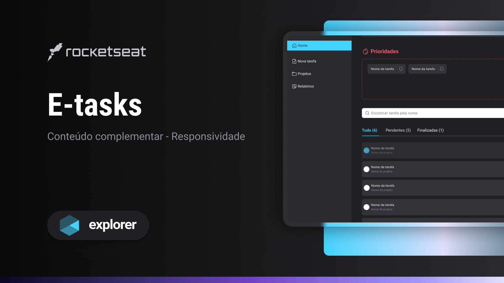

<p align="center">
Conteúdo complementar da trilha Explorer para estudo de responsividade com styled-components.
</p>

<br>

<p align="center">
  
</p>


## 💻 Projeto

E-tasks é um projeto desenvolvido durante módulo de Responsividade com Styled-components da trilha Explorer da Rocketseat. Portanto, o foco não foi o desenvolvimento das funcionalidades, mas sim da aplicação de responsividade à interface da aplicação.

## :information_source: Passo-a-passo

Para clonar e rodar a aplicação, será necessário [Git](https://git-scm.com), [Node.js v14.16](https://nodejs.org/en/) ou versão mais recente + [NPM v8](https://nodejs.org/en/) ou mais recente instalados. 
Linhas de comando:

```bash
# Clonar o repositório
$ git clone https://github.com/guitotti/explorer-e-tasks

# Navegar até o repositório
$ cd explorer-e-tasks

# Instalar dependências
$ npm install

# Rodar o projeto em ambiente de desenvolvimento
$ npm run dev
```

